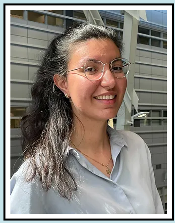

Hi, my name is Orlena, $${\color{blue}Welcome \space to\space my \space \ {website}}$$

* # Who I am?
  
I am a PhD student in Dr.Ofer Shoshani lab. I started my PhD a year ago and study biogenesis of Gene amplification and his role in the development of cancer. 

* # My home | :house_with_garden:

  I am a **French** woman born in Paris. I lived half of my life in Toulouse, a city in the south of France called the "pink city" because the walls look are pink/red in the sun.

* # My research
  
In our lab, we study gene amplification and all types of genomic catastrophes that can induce the development of tumors. We are a relatively young lab, around 3 years old, if you want more information, you can visit our site:
[site](https://www.weizmann.ac.il/Biomolecular_Sciences/Shoshani/home)

* # Python course
  
I chose to take the Python course for several reasons:
1. I have always had projects and wanted to implement them but as I don't know how to code I am limited.
1. I think this is a significant skill these days and which is rewarding when looking for a job.

PS: **Thank you Gabor** for giving me the chance to participate in this course. :pray:

